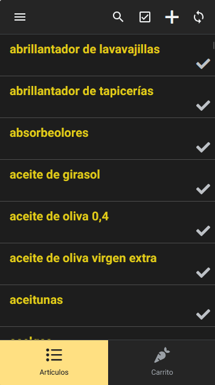
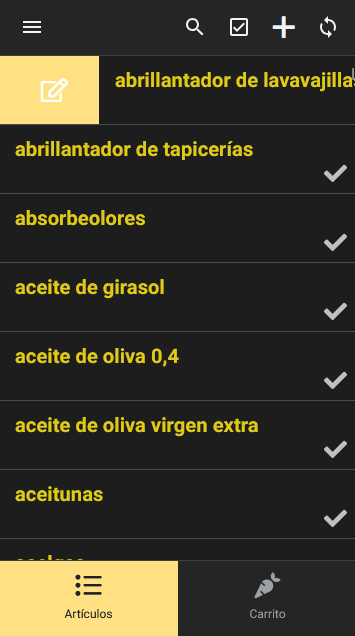

# 🛒 Smart-Fridge-NFC: Sistema de compra de productos alimenticios.


Un sistema de gestión de inventario doméstico e integración IoT diseñado para agilizar la compra semanal. El proyecto conecta hardware (etiquetas NFC) con una aplicación web progresiva (PWA) de desarrollo propio, permitiendo a múltiples usuarios actualizar una base de datos centralizada en tiempo real sin necesidad de autenticación.

## 🚀 El Problema y la Solución

**El Problema:** La gestión de la lista de la compra familiar solía depender de aplicaciones de terceros desactualizadas, requiriendo inicio de sesión constante, copias de seguridad manuales en bases de datos locales (SQLite) y falta de sincronización en tiempo real entre los miembros de la casa.

**La Solución:** Se ha diseñado un flujo de trabajo que elimina la fricción del usuario final. Mediante el escaneo de una etiqueta NFC situada en el frigorífico, cualquier miembro de la familia accede instantáneamente a una interfaz minimalista para marcar productos agotados. Estos datos se sincronizan al instante en la nube, generando una lista de la compra interactiva para el supermercado.

## 🛠️ Tecnologías y Arquitectura

*   **Hardware:** Etiquetas NFC (NTAG215) para despliegue físico y acceso "Zero-Click".
*   **Data Extraction & Migration:** `Bash`, `SQLite3` (Ejecutado en entorno Ubuntu/WSL para migrar los datos *legacy* de la app anterior a un formato CSV limpio).
*   **Database:** Google Sheets actuando como base de datos relacional y backend de acceso rápido.
*   **Frontend:** AppSheet (Configurado como PWA pública de solo lectura/edición rápida, con diseño UI/UX en modo oscuro).

## ⚙️ Características Principales

*   **Acceso Anónimo e Instantáneo:** Interfaz pública sin barreras de entrada (No-Auth) mediante lectura NFC.
*   **Base de Datos Reactiva:** Los identificadores únicos (IDs) se generan en segundo plano `UNIQUEID()`, manteniendo una interfaz limpia (Solo lectura/escritura del nombre del producto y estado).
*   **UI/UX Optimizada:** Gestos táctiles de deslizamiento rápido (Swipe-to-edit/delete) adaptados para el uso con una sola mano durante la compra.
*   **Filtros de Vista Dinámicos:** Separación automática entre "Inventario General" y "Carrito Activo" basada en valores booleanos.

## 🗄️ Migración de Datos (Legacy)

Para poblar la base de datos inicial, se realizó ingeniería inversa sobre la copia de seguridad de la aplicación móvil antigua. Se utilizó un script de Bash para extraer y limpiar la información de la base de datos SQLite original:

```bash
sqlite3 backup_antiguo.db -header -csv "SELECT nombre_producto FROM inventario;" > inventario_limpio.csv
```

## 📸 Demostración Visual

Aquí puedes ver la interfaz principal de la aplicación optimizada para el uso con una sola mano, incluyendo el inventario general y las acciones rápidas mediante gestos (swipe-to-edit):

             

## 👨‍💻 Autor

LinkedIn: https://www.linkedin.com/in/enrique-b%C3%A1ez-galeras-b56278395/

GitHub: @EnriqueB938
